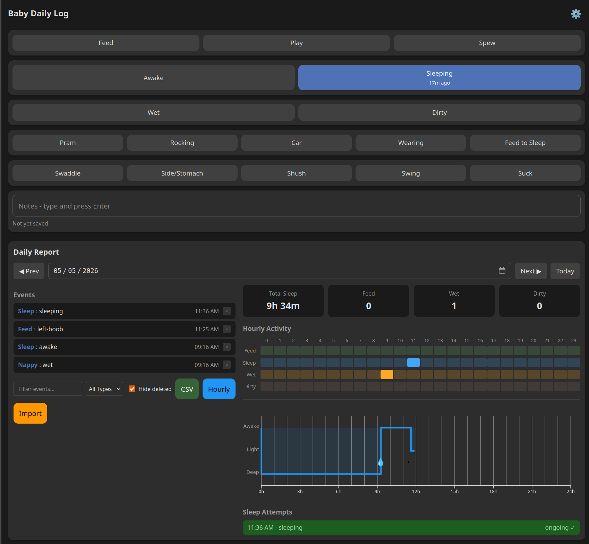

# BabyTrack

A baby activity tracker PWA for lactation consultants and their clients. Collaborative, real-time, works offline.



## Features

- **Track events** — feeds (breast/bottle/solids), sleeps, wet/dirty nappies, soothing, configurable
- **Real-time sync** — Mum, Dad, and the night nurse all see updates instantly via WebSocket
- **Offline-first** — fully works without internet; syncs when reconnected
- **No logins for carers** — shareable magic links get carers started in one tap
- **Admin dashboard** — consultant manages families, views daily/hourly summaries, generates access links
- **Dark mode** — follows system preference
- **CSV import/export** — move data between families
- **Self-hosted** — single Go binary + SQLite. Runs on a $5 VPS or free Fly.io tier

## Quick Start

```bash
git clone <repo-url>
cd babytrack

# Admin user is created on first run
ADMIN_USER=admin ADMIN_PASS=choose-a-password go run ./server
```

Open [http://localhost:8080/admin](http://localhost:8080/admin) to log in as admin and create your first family.  
Open [http://localhost:8080](http://localhost:8080) and enter an access link token to start tracking.

## Docs

- **[Deploying](docs/DEPLOY.md)** — Docker, Fly.io, VPS, backups, environment variables
- **[Developing](docs/DEVELOPMENT.md)** — project structure, build, test, modify
- **[Backend Reference](docs/backend.md)** — API endpoints, data model, sync protocol
- **[Sync Protocol](docs/sync-protocol.md)** — cursor-based real-time sync design
- **[Testing](docs/testing.md)** — test strategy and coverage

## Tech Stack

| Layer     | Stack                        |
|-----------|------------------------------|
| Backend   | Go 1.25+, SQLite, WebSockets |
| Frontend  | Vanilla JS, IndexedDB, D3.js |
| Auth      | bcrypt, cookie-based sessions |
| Testing   | Go stdlib, Playwright, ESLint |
| Deploy    | Docker, Fly.io               |
